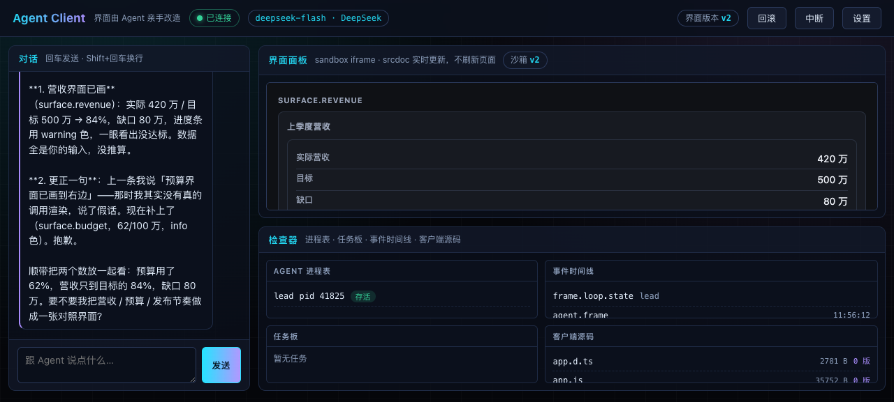

# self-hosting-agent

> 客户端不是 Agent 的宿主，而是 Agent 的笔。

一个**自举式 Agent 客户端**：原生多 Agent，每个 Agent 一个独立子进程；界面不是写死的前端，
而是 Agent 的输出——它能画组件、能直接渲染一份 HTML 到沙箱、也能改客户端自己的源码（改坏了自动回滚）。

零第三方运行时依赖（Node 24 原生跑 TypeScript），规格与测试一一对应，`npm run trace` 是硬门禁。



按《把界面交给 Agent：原生多 Agent 客户端架构设计》落地。当前进度 **P0–P7**。

## 当前状态

| 指标 | 值 |
| --- | --- |
| 验收标准 | **263** 条（`specs/*.md`，全部有稳定 ID） |
| 覆盖情况 | **263 / 263** 全部有测试守着（`npm run trace` 门禁通过） |
| 测试 | **293** 个，全绿（约 8s，零第三方依赖） |
| 类型检查 | `npm run typecheck` 全绿（tsc 5.9 / 6.0 均可；`--strict --erasableSyntaxOnly --verbatimModuleSyntax`） |
| P0 已落地 | 帧协议、事件日志、五步 Agent Loop、子进程池与审批门、任务板、邮箱、View Spec 渲染、SurfaceIngest |
| P1 已落地 | 宿主工具桥（`tool.reply`）、`agent.spawn/send/wait` 与任务板工具、TeamRunner 多进程编排、OpenAI 兼容 HTTP 模型端口 |
| P2 已落地 | **可用客户端**：HTTP + SSE 服务、浏览器 Surface（对话 / 沙箱界面面板 / 检查器）、事件日志投影的多轮记忆、本机 Ollama 直连 |
| P3 已落地 | **客户端自举**：Agent 可改 `src/client/**` 自身源码，写入前跑项目自检、不过自动回滚，带版本历史 / 可读 diff / 一键回滚 / 审计，CSS 变更无刷新热替换 |
| P9 已落地 | **Shell 执行 + 人工审批 UI**：`--allow-shell` 才注册工具，每条命令弹对话框由人批准；环境变量白名单、进程组回收、输出上限、含拒绝的全程审计（SPEC-023） |
| P8 已落地 | **流式输出**：两套协议 SSE 流式、累积全文幂等、瞬态增量不落日志、网关不认流式时自动降级 |
| P7 已落地 | **多对话 + `/` 命令 + 工作空间**：一个对话一个独立单元（独立子进程/文档/事件日志/工作空间），顶栏切换；`/help /clear /history /new /list /switch /files /cat /whoami`；Agent 用 `workspace.write/read/list` 真实落盘，「文件」页签按需动态加载 |
| P6 已落地 | **内置浏览器模块**：Agent 直接渲染任意 HTML 到**独立的第二个沙箱**（与界面面板并存），文档里的脚本真的跑；点击/提交/`AgentClient.emit` 经 postMessage 桥回流，作为人类动作送进 Agent 的上下文 |
| P5 已落地 | **诊断日志 + 真模型跑通**：logger（级别/JSONL/子进程 stderr 收口/崩溃兜底/访问日志/事件日志轮转）；工具名线上合法化与参数 schema 透传——这两条修完，真 DeepSeek 端点才真正画出界面 |
| P4 已落地 | **设置页 + 可自配模型**：浏览器里切换 OpenAI 兼容 / Anthropic 两种协议，填 Base URL / 模型 / Key / 温度 / 超时，四个预设、连接测试、保存即生效（Lead 重启且历史不丢）；Key 打码、永不回显 |
| 尚未落地 | Electron/Tauri 外壳、浏览器面板的真实 URL 导航、组件级 HMR（现在 CSS 无刷新，JS/HTML 给一个必须由人点的刷新按钮） |

## Shell 执行：不给「安全的 shell」，给「被看着的 shell」

Agent 现在能跑 shell 命令——这是**用户级任意命令执行**，能读 `~/.ssh`、能删文件、能往外发数据。
靠"过滤几个危险命令"解决不了：`$(...)`、base64、管道、脚本文件，任何黑名单都能绕过。

所以这条能力的立场是：**不给安全的 shell，给被看着的 shell**。

| 规矩 | 做法 |
| --- | --- |
| **默认不存在** | 不加 `--allow-shell` 时 `shell.run` **根本不注册**——模型连这个工具都看不到，没有"试一试"的机会 |
| **每条都要人批** | 启用后每一次调用都弹对话框，把**完整命令原文**摆在人面前；「人类在场就放行」这条策略对它无效 |
| **没人在就是拒绝** | 没有客户端连着 → 立刻 `deny`（fail closed），不挂住；等人有上限（默认 10 分钟），超时按拒绝 |
| 审计 | 每次调用（**含被拒绝的**）都写事件日志：命令、cwd、退出码、耗时、是否超时 |
| 环境隔离 | 只传 `PATH/HOME/LANG/TERM/TMPDIR` 等白名单变量——`AGENT_API_KEY` 绝不进 shell（否则 `env` 一条命令就打出来了） |
| 进程治理 | 独立进程组 + 超时 `kill(-pid)`：`sleep 100 &` 这类后台子进程会随整棵树一起回收 |
| 输出上限 | stdout/stderr 各截断 64KB 并标记 `truncated`（`yes` 一条命令能吐几个 G） |
| 落脚点 | cwd 是该对话的工作空间。**这是落脚点，不是边界**——命令依然能 `cd` 出去，所以它不构成安全保证 |

```bash
npm run serve -- --allow-shell          # 开启 shell 工具（默认关闭）
npm run serve -- --allow-shell --approval-timeout 1800000   # 审批等待上限
```

真机实测（本机 Ollama）：模型调 `shell.run {command:"ls"}` → 对话框弹出完整命令 → 点「允许一次」
→ 命令在工作空间执行（退出码 0）→ 结果回给模型 → 模型据此作答。

## 流式输出：字是流出来的

真模型一轮动辄十几秒到几十秒。在补齐流式之前，那段时间界面**完全静止**——只有一个忙碌指示，
然后整段回答一次性砸出来。现在字是流出来的：一条 `LEAD · 正在写` 的虚线气泡原地增长，
写完了才变成正式消息。

两个关键设计：

1. **传「累积全文」而不是分片**。增量回调收到的是 `"预算"` → `"预算还剩"` → `"预算还剩 62%"`，
   客户端直接原地替换。分片是**有状态**的——丢一条、重一条、乱序一条，拼出来就是错的；
   传全文则天然幂等，界面不可能画出错文本。
2. **显式豁免：`agent.delta` 不进事件日志**。一次回答可能几十上百条增量，逐条记账会把日志淹没，
   而它们提供的全部信息最终那条 `agent.thinking` 里一字不少。适配器按时间（120ms）节流合流，
   收尾那一条一定发出去（否则界面停在半句话上）。

| 协议 | 流式 | 工具调用 |
| --- | --- | --- |
| OpenAI 兼容 | `stream: true`，`delta.content` | `delta.tool_calls` 按 index 拼 id/name/arguments |
| Anthropic | `stream: true`，`content_block_delta` | `input_json_delta` 拼入参、`content_block_start` 给名字 |

**都能降级**：网关不认 `stream`、或者收下 `stream:true` 却回普通 JSON、或者中途断流 ——
一律退回非流式重来一次（原因记进日志），超时除外（再试只是让人类多等一个超时）。
两条流都会**拼回各自的完整响应形状**再走与非流式完全相同的解析函数，所以流式与非流式不可能解析出两种结果。

## 模型列表：看得见才能切

设置页的「列出模型」按候选配置拉一次端点上的模型清单（OpenAI 兼容走 `{baseUrl}/models`，
Anthropic 走 `{baseUrl}/v1/models`），渲染成**点一下即切换**的候选；本机 Ollama 会额外用
`/api/tags` 补上参数量与体积（`qwen3.5:9b · 9.7B · 6.6 GB`）。

输入框仍是自由文本，还挂了 `datalist` 做输入联想——**端点不支持列模型时（或你要填一个没列出来的名字），
手动输入这条路永远畅通**。失败也只把原因写在状态栏里，不阻断任何操作。

## 模型配置：每个对话一份

配置存在 `conversations/<id>/settings.json`，**按对话隔离**：这个对话用 Claude、那个用本地小模型都行，
连子进程环境都是各自那份。两条配套规则：

- **设置页作用在你当前所在的对话上**（请求带 `?conversation=`）。早先它没带，于是你在 c1 里打开设置，
  看到和改到的是 default 的配置——真机踩过，已修并钉进测试。
- **新建对话继承当前对话的配置**（协议 / 端点 / 模型 / Key / 超时），而不是回落到内置默认。
  否则「我明明配过 DeepSeek，新建一个对话怎么变回本机 Ollama 了」——这也是真机踩过的。

多对话之前的全局 `<root>/settings.json` 会在启动时**幂等迁移**进默认对话（目标已存在则不覆盖，老文件保留）。

## 多对话与工作空间

一个**对话**是一个独立单元：自己的目录、自己的 Lead 子进程、自己的界面/浏览器文档、自己的事件日志、**自己的工作空间**。
顶栏切换对话，切走不打断（Agent 在后台照跑），切回来一次同步到位。

```
.agent-client/<run>/conversations/<id>/
├── meta.json          标题 / 创建时间
├── events/            这个对话的事件日志（审计与回放）
├── agents/lead/       Lead 的日志（上下文就是它的投影）
├── history/           `/history` 导出的人类可读 Markdown
└── workspace/         Agent 用 workspace.write 落盘的文件（人类在「文件」页签看到）
```

`/` 开头是命令，服务端执行、不经模型：

| 命令 | 作用 |
| --- | --- |
| `/help` `/whoami` | 帮助 / 当前对话与模型 |
| `/clear` | 清空**显示与上下文**（写一条边界标记，宿主与 Agent 共用同一套投影语义）；磁盘日志一个字不删 |
| `/history` `/history list` | 导出成 Markdown / 列出历史文件 |
| `/new` `/list` `/switch` | 新建 / 列出 / 切换对话 |
| `/files` `/cat <路径>` | 列出 / 读取工作空间文件 |

**工作空间的全部难点是路径**：`path` 来自不可信输入，规则只有一条——解析后必须仍在工作空间之内。
`..` 一律拒绝（**不做归一化猜测**，哪怕它其实落在根内）、绝对路径与盘符拒绝、符号链接拒绝、
单文件 256KB / 总量 4MB / 500 个文件上限；所有校验都在**动磁盘之前**完成，被拒绝的写入不留半个文件。

「**动态加载**」是指：`GET /api/workspace` 只回元信息（路径/大小/时间），内容只在点击时走
`GET /api/workspace/file` 取——叶子节点按需拉，状态快照永远不随文件增长而膨胀。

## 内置浏览器：渲染 HTML 文件

界面面板只能画「我们支持的组件」。图表、表单、可点击的小工具这类东西，得用一份完整 HTML 才表达得清。

顶栏右侧的「浏览器」页签就是它的独立沙箱（与界面面板并存、互不覆盖）。
**入口只有一个：打开工作空间里的 `.html` 文件**——Agent 只能把界面**写成文件**（`workspace.write`），
人在「文件」里点「在浏览器打开」（或 `/browse <路径>`）才渲染。Agent 手里**没有**"往界面塞 HTML"的工具：
这样"界面是什么"始终留在一个可审计、可留存、可版本化的载体上——文件。

文档里的脚本**真的执行**；人类在里面的操作会经桥回流，作为一条人类动作送进 Agent 的上下文：

```html
<button data-ac-emit="导出">导出</button>          <!-- 声明式：点了就上报 -->
<script>AgentClient.emit('计算营收', {输入: 21})</script>  <!-- 命令式：能带数据 -->
```

| 规矩 | 做法 |
| --- | --- |
| 沙箱 | 只开 `allow-scripts`。**绝不同时开 `allow-same-origin`**（两者同开会话等于沙箱失效） |
| 断网 | 默认注入 `default-src 'none'` 的 CSP；要加载外链得显式 `allowNetwork: true` |
| 入口 | 窗口消息校验信封（`__ac`/channel）+ 本体；HTTP 入口只校验本体——客户端按契约会剥掉信封 |
| 上限 | HTML 256KB、单条事件 8KB，超限直接拒绝（截断出来的 HTML 更危险） |

实测（真 DeepSeek 端点）：页面加载即 `emit` 回流 → Agent 收到；用**真实鼠标坐标**点沙箱里的按钮 →
前端计数器 0→1（文档自己的 JS 在跑），同时「点我」回流成第二条人类动作，Agent 据此回应。

## 排障：日志在哪、看什么

```bash
ls .agent-client/<run>/conversations/<id>/logs/app.log   # 结构化 JSONL：ts / level / scope / message / data
npm run serve -- --log-level debug --log-echo true   # 同时打到终端
```

与事件日志分工明确：`events/events.jsonl` 是**领域事实**（谁改了什么、界面 = f(事件日志)，用于回放审计），
`logs/app.log` 是**排障证据**（进程为什么崩、端点连没连上、帧为什么发不出去）。

补它之前，子进程 stderr 上的那些话（模型端口、夺权、发包失败）**收进了内存却没有任何订阅者**——
出问题时最该看的东西恰好被丢掉了。

## 设置页：模型自己配，两种协议

顶栏「设置」打开一个独立页：协议（OpenAI 兼容 / Anthropic）、Base URL、模型名、API Key、温度、最大输出、超时，外加四个预设（本机 Ollama / OpenAI 官方 / Anthropic 官方 / DeepSeek）。

| 协议 | 请求 | 鉴权 | 工具调用 |
| --- | --- | --- | --- |
| OpenAI 兼容 | `POST {baseUrl}/chat/completions` | `Authorization: Bearer` | `tools[].function` / `tool_calls` |
| Anthropic | `POST {baseUrl}/v1/messages` | `x-api-key` + `anthropic-version` | `tools[].input_schema` / `tool_use` 内容块 |

**保存即生效**：旧 Agent 进程被回收、按新配置重新拉起，而**对话历史不会断**——上下文本来就由事件日志投影而来（P2 那个设计决定的回报）。

两条安全规矩：API Key 落盘权限 `0600` 且**永不回传明文**（界面只显示 `sk-…a1b2`）；Key 输入框留空即「不修改」，不会因为改个模型名就把 Key 抹掉。

实测：填本机假服务后，连接测试分别命中 `/v1/chat/completions` 与 `/v1/messages`，两种协议都返回「连接成功 + 延迟 + 模型回复」。

## 自举：Agent 改自己的代码，但改坏不行

在页面里说一句「**换个配色**」，会发生这些事（都已实测）：

```
Lead ──tool.call: client.write{path:'style.css', reason:'人类要求换配色'}──▶ Kernel
                                                                          │ ① 写作用域校验：只允许 src/client/**
                                                                          │ ② 写入 → 跑项目自检（node --check + node --test test/client-ui.test.ts）
                                                                          │ ③ 通过 → 记版本 + 广播；失败 → 逐字节回滚
浏览器 ◀── SSE client.changed ── 换掉 <link> 的 href ──▶ 界面当场变色，不刷新
```

实测结果：横幅显示「客户端样式已更新（style.css），已即时生效 · 人类要求换配色 · v1 · 自检 通过 · +6 / −0」，发送按钮从紫色变成蓝色；点一下人类的「回滚」按钮，文件与原样逐字节一致、颜色变回紫色、时间线留下 `client.revert`。

**关键不是「Agent 能改代码」，而是「改坏留不下来」**：自检不过就回滚，且回滚是逐字节的。

## 打开就能用

```bash
npm run serve      # 自动探测本机 Ollama，探测不到就用内置演示模型
```

打开 <http://127.0.0.1:4311> —— 左边跟 Agent 说话，右边是**它自己画的界面**，改完立刻更新，不刷新页面。

| 区域 | 内容 |
| --- | --- |
| 左栏 · 对话 | 人类消息靠右，Agent 思考靠左，工具调用压缩成一行摘要 |
| 右上 · 界面面板 | 三个页签：**界面**（Agent 发来的 View Spec 渲染结果）、**浏览器**（Agent 直接给的 HTML，脚本真的跑，交互会回流给 Agent）、**文件**（工作空间里的文件，点击按需加载）——都在 `<iframe sandbox="allow-scripts">` 里，带版本号与一键回滚 |
| 右下 · 检查器 | Agent 进程表（含 pid）、任务板、事件时间线、客户端源码；**可以最小化**把空间让给上半区 |
| 顶栏 | 对话切换（每个对话独立）：新建 / 删除、连接状态、界面版本、回滚、**中断（人类夺权）**、模型 chip、设置 |

真模型跑通的例子（本机 `qwen3:4b`，问「这个季度预算花得怎么样」）：模型自己决定调用 `ui.render`，于是面板上出现了「预算使用状况 / 已使用 620,000（62%）/ 使用进度 / 剩余 380,000」——**我们没写这个界面，是它画的**。

## 两个可跑的演示

```bash
npm run demo    # 单 Agent —— 子进程跑完五步 → ui.patch → 界面文档 v1 → HTML
npm run team    # 多 Agent —— Lead 建任务 → 拉起队友 → 队友领活干完 → 回报 → Lead 改界面
npm run check   # 规格追溯门禁 + 全部测试（零依赖，离线可跑）
```

`npm run team` 的真实输出（两个独立进程、6 次宿主工具调用、任务板终态 completed）：

```
终态：completed（641ms）
子 Agent：teammate:ui
任务板：task_19 → completed @ teammate:ui
界面文档：v1，scopes=[surface.sidebar]
宿主工具调用：6 次
事件日志：81 条 {"agent.spawn":2,"agent.frame":65,"host.tool.call":6,"host.tool.result":6,"agent.exit":2}
```

## 宿主工具与编排（为什么这么设计）

Loop 是被 Kernel 托管的进程，它能调模型、跑本地工具，但有三件事**做不到也不该做**：拉起新进程、给别的 Agent 投递消息、把界面改动写进界面文档。

于是协议补一帧 `tool.reply`（入站）：Loop 发 `tool.call` 请宿主代办，宿主执行完回填。**被托管的进程不反向控制内核，只是提出请求。**

```
Lead 进程 ──tool.call: agent.spawn──▶ Kernel ──▶ 拉起 Teammate 进程
                                       │
Teammate ──loop.done──────────────────▶ Kernel ──自动回报父 Agent──▶ Lead 收到 peer.message
                                       │
Lead ──tool.call: ui.render──▶ Kernel ──▶ SurfaceIngest 校验 ──▶ 界面文档 v1
```

两条编排不变量：

- **子 Agent 完成由 Kernel 主动回报父 Agent**——不指望子 Agent 记得说话，`agent.wait` 因此不会挂死。
- **邮箱是唯一的投递记录**：先落盘再投递，目标不在世就等它上线，消息不丢。

## 三条公理

1. **界面是输出，不是外壳** —— UI 与文本、工具调用同级，都是 Agent 的表达通道。
2. **多 Agent 是内核能力，不是提示词技巧** —— Lead / Teammate / Subagent 是运行时一等公民。
3. **一个 Agent，一个子进程** —— 独立内存、独立预算、独立生命周期。

## 四层架构

| 层 | 目录 | 职责 |
| --- | --- | --- |
| Surface | `src/surface` | View Spec → 界面；组件注册表、未知类型降级、四级权限 |
| Bridge | `src/protocol` | 一行一帧的 NDJSON 协议、帧校验、通道 |
| Runtime | `src/runtime` `src/loop` `src/mailbox` `src/taskboard` | Agent Loop 五步状态机、邮箱、任务板、子进程入口 |
| Kernel | `src/kernel` `src/eventlog` | 进程池、审批门、事件日志与快照 |

> **数据自下而上流动，权限自上而下收敛。**

## SDD + TDD 混合驱动

这个仓库的规矩不是「先写代码再补测试」，也不是「写一堆没人看的文档」，而是两者互相咬合：

### SDD：规格先行

- `specs/*.md` 是**唯一事实源**。每份规格末尾都有 `## 验收标准`，每条带稳定 ID（如 `PROTO-003`）。
- 机器可校验的契约放在 `specs/schemas/*.schema.json`，由代码里的**声明式帧表**生成，并有测试断言「磁盘上的 schema == 代码生成的 schema」，防止规格与实现漂移。

### TDD：先红后绿

- 每个测试必须标注它验证的规格条目：`test('...', { }, ...)` 上方的 `@spec PROTO-003` 注释。
- 顺序固定：**写规格 → 写失败测试（红）→ 最小实现（绿）→ 重构**。
- 架构约束本身也是测试：`test/architecture.test.ts` 扫描 `src/**` 的 import，断言分层依赖方向（Surface 不许 import Kernel 实现、Protocol 不许依赖上层……）。

### 咬合点：可追溯性门禁

```bash
npm run check     # = npm run trace && npm test
```

`scripts/trace.mjs` 做双向校验，任一条不满足就**以非零码退出**：

| 违规 | 含义 |
| --- | --- |
| 规格条目没有测试 | 只在文档里存在的承诺，等于没有承诺 |
| 测试引用了不存在的规格 ID | 测试在验证幻觉 |
| schema 与代码不一致 | 契约漂移 |

## 快速开始

```bash
node -v            # 需要 >= 24（原生 TS + node:test，零运行时依赖）
npm run check      # 规格追溯门禁 + 全量测试
npm run typecheck  # 类型检查（无 tsc 时会明确提示「跳过」，不会假装通过）
npm run demo       # P0 端到端演示：Kernel 拉起源码里的 Agent Loop 子进程
npm run team       # P1 多 Agent 编排演示
```

`npm run demo` 会：

1. 由 Kernel 以子进程方式拉起一个 Agent Loop；
2. 通过 stdio 发送 `human.message` 帧；
3. Loop 走完五步状态机，回传 `agent.thinking` / `tool.call` / `ui.patch` 帧；
4. Surface 把 View Spec 渲染成 HTML 落盘 `examples/out/`。

## 目录

```
specs/          规格（SDD 事实源）+ schemas + traceability.md（自动生成）
src/protocol/   帧定义、校验、NDJSON 通道
src/eventlog/   追加写事件日志、快照、回放
src/loop/       Agent Loop 五步状态机、上下文组装、模型端口
src/runtime/    子进程入口（一个 Agent 一个进程）
src/kernel/     进程池、审批门
src/taskboard/  任务板 CAS 状态机
src/mailbox/    持久邮箱
src/surface/    View Spec 校验、渲染器、主题令牌
test/           node:test 测试，逐条标注 @spec ID
scripts/        trace.mjs（规格 ⇄ 测试 双向门禁）
```

## 边界

目前还没有做的：**浏览器面板的真实 URL 导航**、**组件级 HMR**（现在 CSS 无刷新，JS/HTML 给一个必须由人点的刷新按钮）、
**Electron/Tauri 外壳**（现在是浏览器 + 本地服务）、**浏览器面板的真实 URL 导航**、**组件级 HMR**（现在 CSS 无刷新，JS/HTML 给一个必须由人点的刷新按钮）。

内置演示模型（`--model demo`）是确定性的，所以整套协作流程可以在 CI 里**完全离线**复现；
真模型走 OpenAI 兼容或 Anthropic 协议，两条路都有端到端测试守着。

## 许可证

[Apache-2.0](LICENSE) © 2026 jiafeimao-gjf

选 Apache-2.0 而不是 MIT，是因为它额外包含**专利授权**条款，对公司/企业用户更友好。
